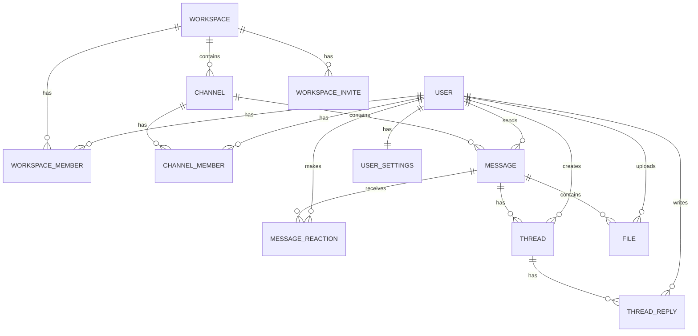

# Database Schema

## Entity Relationship Diagram



## Tables

### User

Stores user account information.

```sql
CREATE TABLE "User" (
  id              String      PRIMARY KEY @id @default(cuid())
  email           String      UNIQUE
  username        String      UNIQUE
  password        String
  displayName     String?
  avatar          String?
  bio             String?
  status          String      @default("offline")
  statusMessage   String?
  lastSeen        DateTime    @default(now())
  createdAt       DateTime    @default(now())
  updatedAt       DateTime    @updatedAt
  deletedAt       DateTime?

  @@index([email])
  @@index([username])
  @@index([status])
);
```

### UserSettings

Stores user preferences.

```sql
CREATE TABLE "UserSettings" (
  id                  String      PRIMARY KEY @id @default(cuid())
  userId              String      UNIQUE @relation(...)
  theme               String      @default("dark")
  notifications       Boolean     @default(true)
  emailNotifications  Boolean     @default(false)
  soundNotifications  Boolean     @default(true)
  language            String      @default("en")
  timezone            String      @default("UTC")
  createdAt           DateTime    @default(now())
  updatedAt           DateTime    @updatedAt
};
```

### RefreshToken

Stores refresh tokens for JWT rotation.

```sql
CREATE TABLE "RefreshToken" (
  id        String      PRIMARY KEY @id @default(cuid())
  userId    String      @relation(...)
  token     String      UNIQUE
  expiresAt DateTime
  createdAt DateTime    @default(now())

  @@index([userId])
  @@index([token])
};
```

### Workspace

Represents isolated communication spaces.

```sql
CREATE TABLE "Workspace" (
  id          String      PRIMARY KEY @id @default(cuid())
  name        String
  description String?
  avatar      String?
  slug        String      UNIQUE
  isPrivate   Boolean     @default(false)
  createdAt   DateTime    @default(now())
  updatedAt   DateTime    @updatedAt
  deletedAt   DateTime?

  @@index([slug])
  @@index([isPrivate])
};
```

### Channel

Represents message channels within workspaces.

```sql
CREATE TABLE "Channel" (
  id          String      PRIMARY KEY @id @default(cuid())
  workspaceId String      @relation(...)
  name        String
  description String?
  slug        String
  isPrivate   Boolean     @default(false)
  archived    Boolean     @default(false)
  createdAt   DateTime    @default(now())
  updatedAt   DateTime    @updatedAt

  @@unique([workspaceId, slug])
  @@index([workspaceId])
  @@index([isPrivate])
  @@index([archived])
};
```

### Message

Stores messages.

```sql
CREATE TABLE "Message" (
  id        String      PRIMARY KEY @id @default(cuid())
  channelId String      @relation(...)
  userId    String      @relation(...)
  content   String
  type      String      @default("text")
  edited    Boolean     @default(false)
  pinned    Boolean     @default(false)
  createdAt DateTime    @default(now())
  updatedAt DateTime    @updatedAt
  deletedAt DateTime?

  @@index([channelId])
  @@index([userId])
  @@index([createdAt])
  @@index([pinned])
};
```

### MessageReaction

Stores emoji reactions on messages.

```sql
CREATE TABLE "MessageReaction" (
  id        String      PRIMARY KEY @id @default(cuid())
  messageId String      @relation(...)
  userId    String      @relation(...)
  emoji     String
  createdAt DateTime    @default(now())

  @@unique([messageId, userId, emoji])
  @@index([messageId])
  @@index([userId])
};
```

### Thread

Represents conversation threads.

```sql
CREATE TABLE "Thread" (
  id        String      PRIMARY KEY @id @default(cuid())
  messageId String      UNIQUE @relation(...)
  userId    String      @relation(...)
  title     String?
  createdAt DateTime    @default(now())
  updatedAt DateTime    @updatedAt

  @@index([messageId])
  @@index([userId])
};
```

### File

Stores file metadata.

```sql
CREATE TABLE "File" {
  id        String      PRIMARY KEY @id @default(cuid())
  messageId String?     @relation(...)
  userId    String      @relation(...)
  fileName  String
  fileSize  Int
  mimeType  String
  url       String
  key       String      UNIQUE
  createdAt DateTime    @default(now())

  @@index([messageId])
  @@index([userId])
  @@index([createdAt])
};
```

## Indexes

Key indexes for performance:

- `User.email` - For login queries
- `User.username` - For user lookup
- `Message.channelId` - For channel message queries
- `Message.createdAt` - For message ordering
- `Channel.workspaceId` - For workspace channels
- `WorkspaceMember.workspaceId` - For member queries
- `RefreshToken.token` - For token validation

## Relationships

- **User** → **WorkspaceMember** (1:M) - Users can be in multiple workspaces
- **User** → **ChannelMember** (1:M) - Users can be in multiple channels
- **User** → **Message** (1:M) - Users send multiple messages
- **Workspace** → **Channel** (1:M) - Workspaces have multiple channels
- **Channel** → **Message** (1:M) - Channels contain messages
- **Message** → **MessageReaction** (1:M) - Messages receive reactions
- **Message** → **Thread** (1:1) - Optional thread per message

## Migrations

Create migrations with:
```bash
npm run prisma:migrate dev --name <migration_name>
```

Apply migrations:
```bash
npm run prisma:migrate deploy
```

Reset database:
```bash
npm run prisma:migrate reset
```
