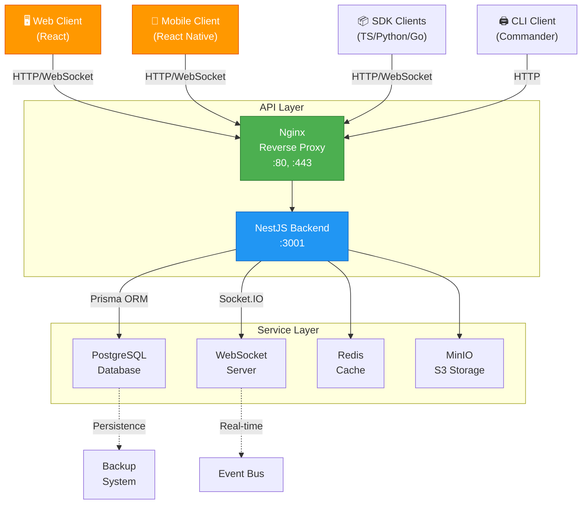
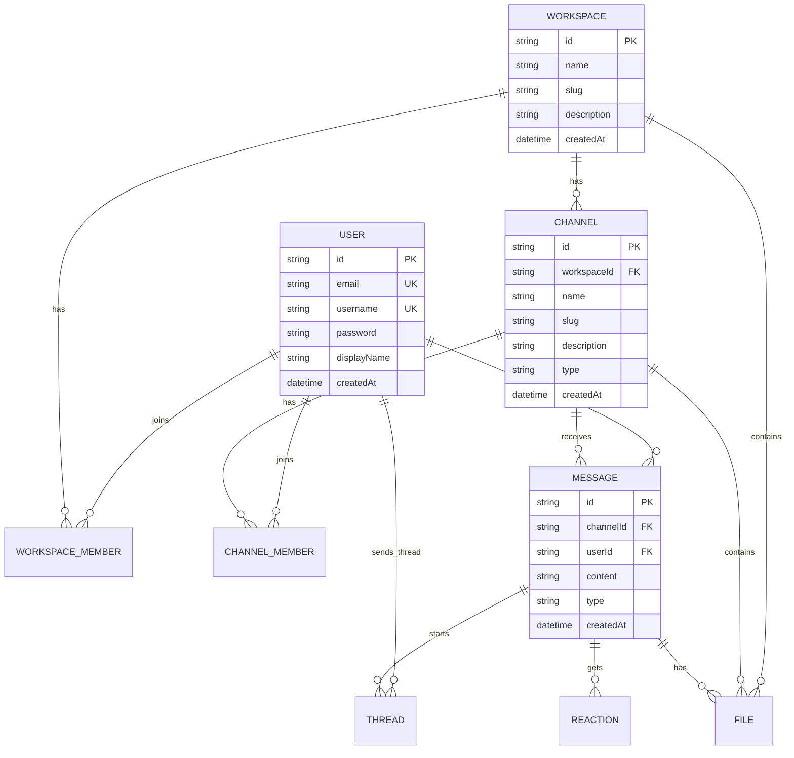
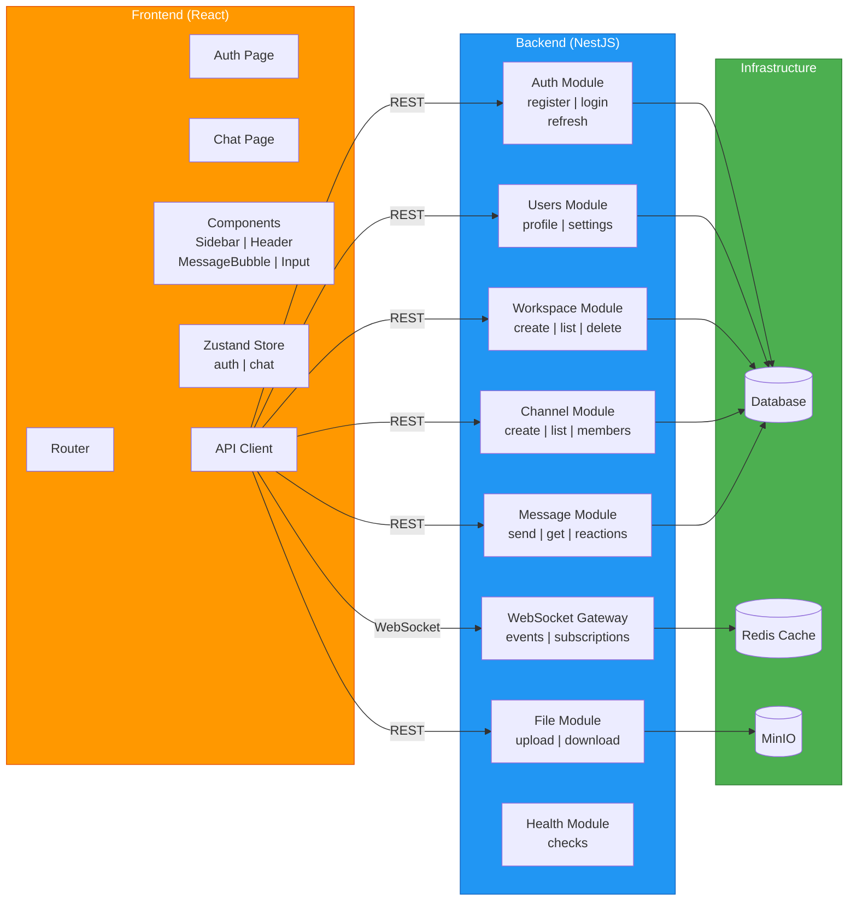
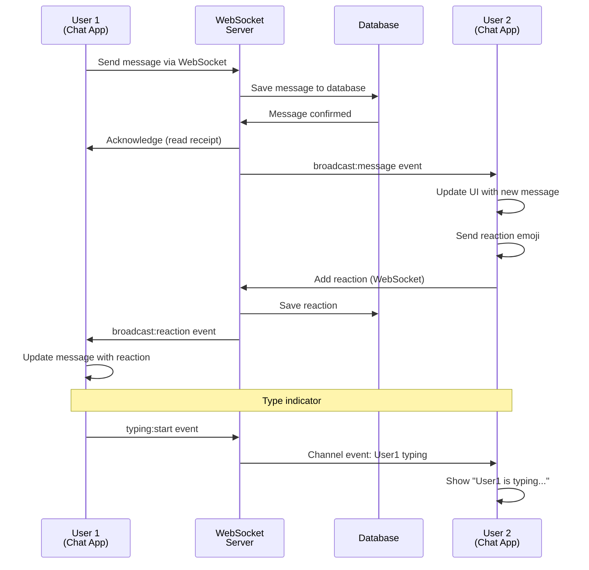
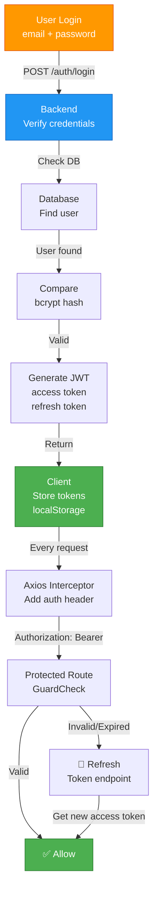
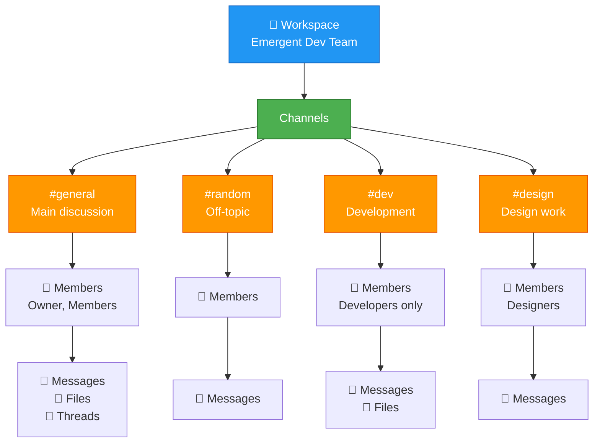
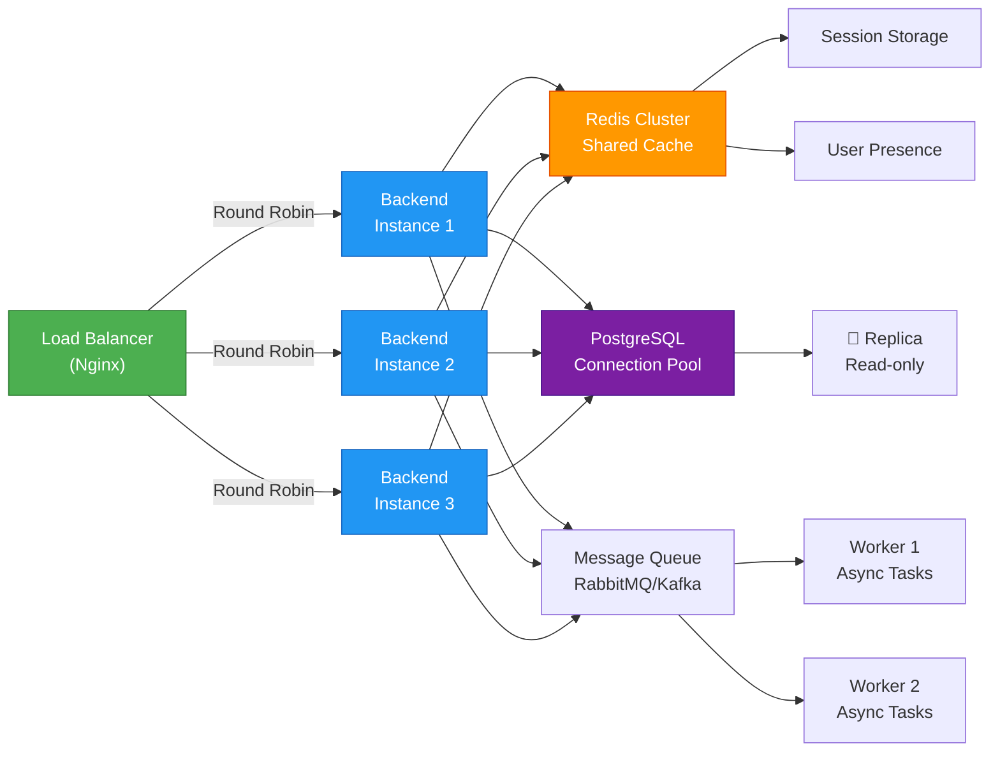

# Architecture Diagrams

## System Architecture

## Database Schema

## Component Architecture

## Deployment Flow

```mermaid
graph LR
    Code["📝 Source Code<br/>GitHub"]
    
    Code -->|Push| CI["🔄 CI Pipeline<br/>Lint | Test | Build"]
    
    CI -->|Success| Registry["🐳 Docker Registry<br/>Image Storage"]
    
    Registry -->|Pull| Prod["🚀 Production<br/>Docker Compose"]
    
    Prod --> Services["Services<br/>Backend | Frontend<br/>Database | Redis<br/>MinIO | Nginx"]
    
    Services -->|Monitor| Health["📊 Health Checks<br/>Liveness | Readiness"]
    
    Health -->|Alert| Team["👥 Team<br/>Notifications"]
    
    style Code fill:#F57C00,stroke:#E65100,color:#fff
    style CI fill:#1565C0,stroke:#0D47A1,color:#fff
    style Registry fill:#4CAF50,stroke:#2E7D32,color:#fff
    style Prod fill:#7B1FA2,stroke:#4A148C,color:#fff
    style Services fill:#00838F,stroke:#006064,color:#fff
    style Health fill:#D32F2F,stroke:#B71C1C,color:#fff
    style Team fill:#F57C00,stroke:#E65100,color:#fff
```

## Message Flow (Real-time)

## Authentication Flow

## Workspace & Channel Hierarchy

## Scaling Strategy

---

## Legend

| Symbol | Meaning |
|--------|---------|
| 🖥️ | Desktop/Web |
| 📱 | Mobile |
| 📦 | Package/Library |
| 🖨️ | CLI |
| 🏢 | Workspace |
| 💬 | Message |
| 📎 | File |
| 👥 | Members/Users |
| ✅ | Success |
| 🔄 | Refresh/Reload |
| 🚀 | Production |
| 📊 | Monitoring |

---

Last Updated: April 2024
For more details, see [Architecture Overview](./architecture.md)
